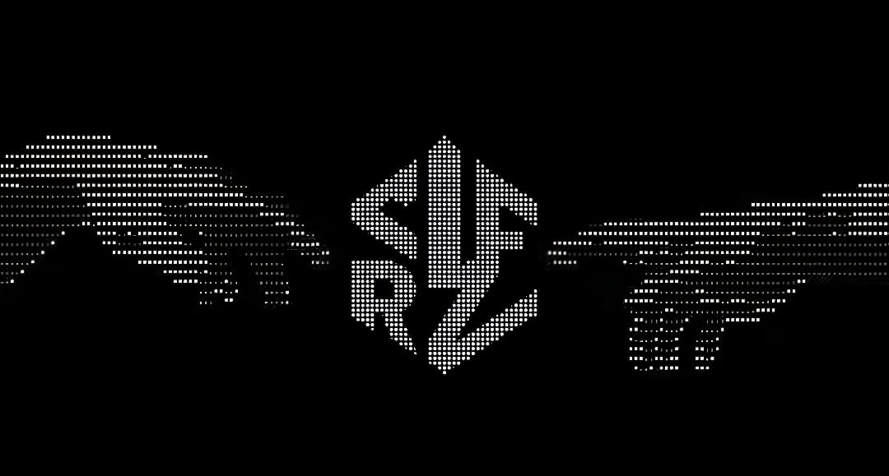

# SIRFZ



Ephemeral State-Machine Chat Terminal. Forensicly deniable, zero filesystem footprint, locked-RAM messenger.

## What it does
SIRFZ is a peer-to-peer chat terminal that maintains **zero persistent state**. 
- **Volatile Execution**: Everything runs in locked RAM (via `mlockall`).
- **No Footprint**: No logs, no config files, and no history are ever written to disk.
- **Secure Shutdown**: Instantaneously wipes all cryptographic material from memory upon exit.

## Quick Start

### 1. Build
```bash
./build.sh
```

### 2. Apply Privileges
Required for memory locking and namespaces.
```bash
./scripts/setup_caps.sh
```

### 3. Start
**Server:**
```bash
./build.sh run-server
```

**Client:**
```bash
./build.sh run-client
```

---
*Type `exit` in the terminal to trigger a secure memory wipe and shutdown.*
